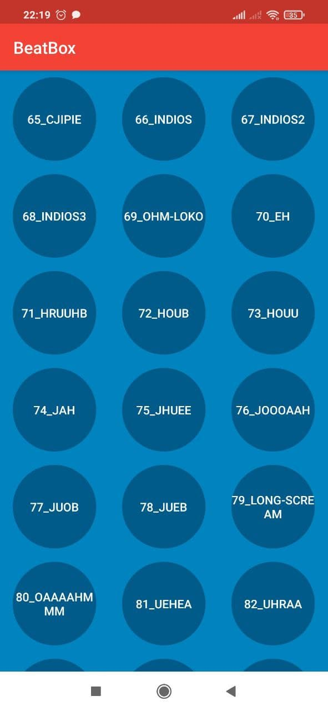

# BeatBox
Еще один тестовый учебный проект, в котором реализованы некоторые возможности операционной системы андроид.
Приложение написано в ходе чтения книги ["Android Programming: The Big Nerd Ranch Guide"](https://www.amazon.com/Android-Programming-Ranch-Guide-Guides/dp/0135245125/ref=dp_ob_title_bk).

Приложение использует привязку данных (data binding), воспроизводит звуки из активов (assets) и реализует собственную тему, в которой использует графические объекты.

